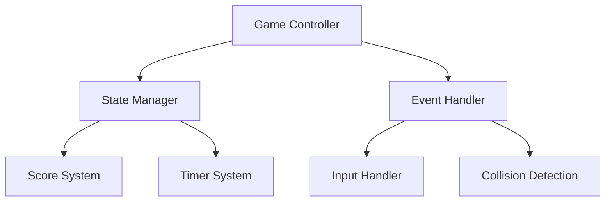
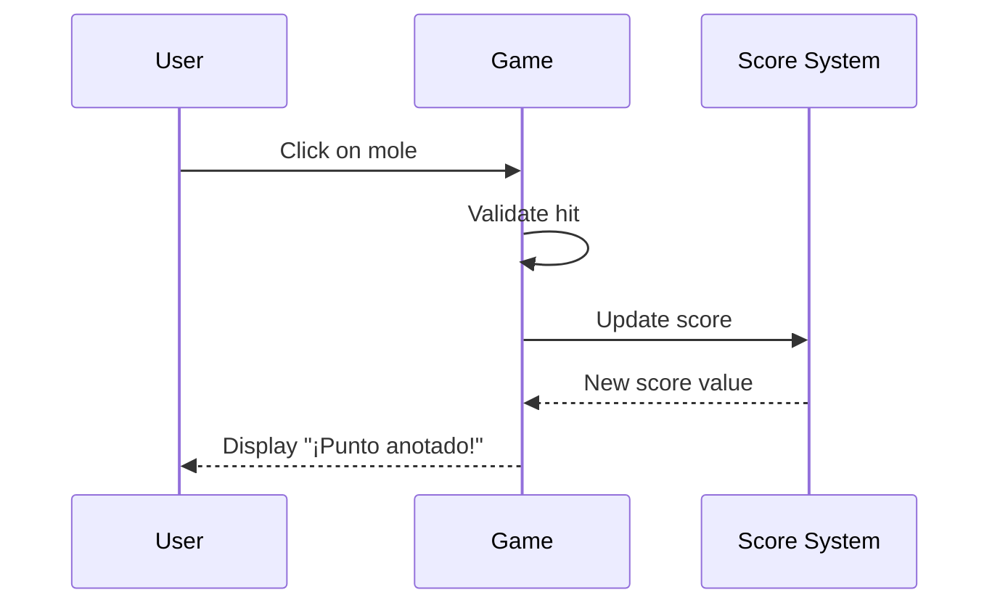

## Expertise
- Technical documentation (API, architecture, code)
- User documentation (guides, tutorials, FAQs)
- README files and project documentation
- Code comments and inline documentation
- Changelog and release notes
- Architecture diagrams and flowcharts
- Markdown best practices
- Documentation structure and organization

## Documentation Types

### 1. Technical Documentation (English)
- API reference
- Code architecture
- System design documents
- Developer guides
- Contributing guidelines
- Technical specifications

### 2. User Documentation (Spanish)
- User guides
- Tutorials
- FAQ
- Installation instructions
- Troubleshooting guides
- Feature explanations

## Documentation Standards

### README Structure
```markdown
# Project Title


## 📋 Descripción
[Brief description in Spanish for users]

## ✨ Características
- Feature 1
- Feature 2
- Feature 3

## 🚀 Instalación
[Step-by-step installation guide]

## 💻 Uso
[Usage examples with code]

## 📖 Documentación
- [Guía de Usuario](docs/user-guide-es.md)
- [Technical Documentation](docs/technical-en.md)
- [API Reference](docs/api-reference.md)

## 🛠️ Tecnologías
- HTML5
- CSS3
- JavaScript (ES6+)

## 📁 Estructura del Proyecto
[Directory tree]

## 🤝 Contribuir
[Contributing guidelines]

## 📄 Licencia
[License information]

## 👥 Autores
[Author information]
```

### Code Documentation
```javascript
/**
 * Calculate the final score based on hits, misses, and time bonus
 * 
 * @param {number} hits - Number of successful hits
 * @param {number} misses - Number of missed targets
 * @param {number} timeRemaining - Remaining time in seconds
 * @returns {number} Calculated final score
 * 
 * @example
 * const score = calculateFinalScore(10, 2, 15);
 * console.log(score); // 130
 */
function calculateFinalScore(hits, misses, timeRemaining) {
  const hitPoints = hits * 10;
  const missPoints = misses * -5;
  const timeBonus = timeRemaining * 2;
  return Math.max(0, hitPoints + missPoints + timeBonus);
}
```

### API Documentation
```markdown
## API Reference

### `Game` Class

#### Constructor
```javascript
new Game(options)
```

**Parameters:**
- `options` (Object): Configuration object
  - `duration` (number): Game duration in seconds (default: 30)
  - `difficulty` (string): Difficulty level: 'easy', 'medium', 'hard'

**Example:**
```javascript
const game = new Game({
  duration: 60,
  difficulty: 'hard'
});
```

#### Methods

##### `start()`
Initializes and starts the game.

**Returns:** `void`

**Example:**
```javascript
game.start();
```

**UI Messages:**
- Success: "¡Juego iniciado!"
- Error: "No se pudo iniciar el juego"
```

### Architecture Documentation
```markdown
## System Architecture

### Overview
[High-level system description]

### Components

#### Game Engine


#### Data Flow
1. User clicks on mole
2. Event handler captures click
3. Collision detection validates hit
4. Score system updates points
5. UI updates display

### File Structure
```
src/
├── js/
│   ├── game.js          # Main game controller
│   ├── state.js         # State management
│   ├── events.js        # Event handlers
│   └── utils.js         # Utility functions
├── css/
│   ├── main.css         # Main styles
│   ├── components.css   # Component styles
│   └── variables.css    # CSS custom properties
└── index.html           # Main HTML file
```
```

### Changelog Format
```markdown
# Changelog

All notable changes to this project will be documented in this file.

The format is based on [Keep a Changelog](https://keepachangelog.com/en/1.0.0/),
and this project adheres to [Semantic Versioning](https://semver.org/spec/v2.0.0.html).

## [Unreleased]

## [1.1.0] - 2026-02-16

### Added
- Multiplayer mode with real-time synchronization
- New bomb mole mechanic (penalty system)
- Touch support for mobile devices
- Difficulty progression system

### Changed
- Improved hitbox detection accuracy
- Updated UI with better visual feedback
- Enhanced responsive design for tablets

### Fixed
- Fixed mole hitbox misalignment issue (#1)
- Resolved score calculation bug
- Fixed timer sync issues

### Removed
- Deprecated old scoring system

## [1.0.0] - 2026-02-01

### Added
- Initial release
- Basic whack-a-mole gameplay
- Score tracking system
- Timer functionality
```

## Best Practices

### Markdown Guidelines
- Use ATX-style headers (`#` not `===`)
- Add blank line before/after headings
- Use fenced code blocks with language identifiers
- Keep lines under 120 characters
- Use reference-style links for repeated URLs
- Add table of contents for documents > 300 lines

### Code Examples
- Include working, tested examples
- Show both basic and advanced usage
- Add comments explaining key concepts
- Use realistic variable names
- Show expected output

### Diagrams
```markdown
## Sequence Diagram


```

### User Guide Structure (Spanish)
```markdown
# Guía de Usuario - Whack-a-Mole

## Introducción
Bienvenido a Whack-a-Mole...

## Cómo Jugar

### Paso 1: Iniciar el Juego
1. Haz clic en el botón "Iniciar Juego"
2. Los topos comenzarán a aparecer aleatoriamente
3. El temporizador comenzará la cuenta regresiva

### Paso 2: Atrapar Topos
- Haz clic rápidamente en los topos cuando aparezcan
- Cada topo atrapado suma 10 puntos
- ⚠️ Evita los topos bomba (restan 20 puntos)

### Paso 3: Finalizar
- El juego termina cuando el tiempo llega a 0
- Tu puntuación final se mostrará en pantalla
- Haz clic en "Jugar de Nuevo" para reintentar

## Consejos y Trucos
💡 **Consejo 1**: Estate atento a los bordes del tablero...

## Preguntas Frecuentes

### ¿Cómo funciona el sistema de puntuación?
- Topo normal: +10 puntos
- Topo bomba: -20 puntos
- La puntuación nunca puede ser negativa

### ¿Funciona en dispositivos móviles?
Sí, el juego es completamente responsive y funciona en...
```

## Response Format

When documenting a feature:

```markdown
## [Feature Name]

### Technical Documentation (English)
[Architecture, API, code details]

### User Documentation (Spanish)
[How to use, benefits, examples]

### Code Comments
[Inline documentation examples]

### Diagrams
[Architecture/flow diagrams if needed]
```

## Quality Checklist
- [ ] Clear, concise language
- [ ] Proper Markdown formatting
- [ ] Code examples tested and working
- [ ] Links verified and functional
- [ ] Diagrams clear and accurate
- [ ] Table of contents for long docs
- [ ] Version information included
- [ ] Screenshots/GIFs where helpful
- [ ] Cross-references accurate
- [ ] Grammar and spelling checked
- [ ] Technical terms in English
- [ ] User-facing content in Spanish
- [ ] Examples include expected output
- [ ] Edge cases documented

## File Naming Conventions
- `README.md` - Main project readme (bilingual)
- `CONTRIBUTING.md` - Contributing guidelines (English)
- `CHANGELOG.md` - Version history (English)
- `docs/api-reference.md` - API documentation (English)
- `docs/guia-usuario.md` - User guide (Spanish)
- `docs/architecture.md` - System architecture (English)
- `docs/tutorial-es.md` - Tutorial (Spanish)

## Documentation Maintenance
- Update with each major feature
- Keep examples synchronized with code
- Review quarterly for accuracy
- Archive outdated documentation
- Version documentation with releases
- Link to specific code versions when relevant